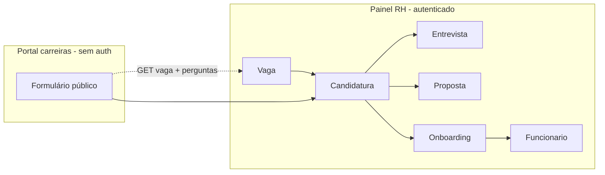

# PeopleCore — Guia Frontend: Módulo de Recrutamento (v2)

Documentação para integração no frontend de **todo o fluxo de recrutamento externo** implementado no backend: requisição de vaga, aprovação, publicação, candidatura pública, triagem, entrevistas com scorecard, proposta, onboarding e contratação automática (criação de Funcionário + Utilizador).

> **Base URL API:** `/api/v1`  
> **Autenticação interna:** `Authorization: Bearer <token>` (exceto rotas `/publico/*`)  
> **Permissão de escrita:** módulo `Recrutamento` (criar/editar/excluir conforme método HTTP)  
> **Permissão de leitura partilhada:** `checkPermissaoQualquer` — qualquer um dos módulos Presenças, Férias, Avaliações, Recrutamento ou Funcionários com acção `ver`

> **Estado (frontend `peoplecore-master`):** módulo Recrutamento v2 implementado. Secções marcadas com ✅ estão concluídas no frontend; ⏳ indicam API disponível mas ecrã/fluxo ainda incompleto ou simplificado.

### Formato de resposta (envelope)

| Padrão | Exemplo | Onde |
|--------|---------|------|
| Lista CRUD | `{ status, results?, data: { data: T[] } }` | vagas, candidaturas, propostas, onboardings |
| Detalhe CRUD | `{ status, data: { data: T } }` | GET `/:id` na maioria dos recursos |
| Acções especiais | `{ status, data: { ...campos } }` | OCR, briefing, analisar, link público, concluir onboarding |
| Erro | `{ status: "fail"\|"error", message }` | 4xx / 5xx |

---

## Índice

1. [Visão geral e mudanças](#1-visão-geral-e-mudanças)
2. [Mapa de implementação no frontend](#2-mapa-de-implementação-no-frontend)
3. [Modelo de dados](#3-modelo-de-dados)
4. [Pipeline Kanban (estados)](#4-pipeline-kanban-estados)
5. [Mapa de ecrãs sugerido](#5-mapa-de-ecrãs-sugerido)
6. [API — Vagas e requisição](#6-api--vagas-e-requisição)
7. [API — Perguntas de triagem](#7-api--perguntas-de-triagem)
8. [API — Candidaturas (principal)](#8-api--candidaturas-principal)
9. [API — Entrevistas](#9-api--entrevistas)
10. [API — Propostas](#10-api--propostas)
11. [API — Onboarding e contratação](#11-api--onboarding-e-contratação)
12. [API pública (portal de carreiras)](#12-api-pública-portal-de-carreiras)
13. [IA opcional (Gemini)](#13-ia-opcional-gemini)
14. [Tipos TypeScript](#14-tipos-typescript)
15. [Fluxos de UI](#15-fluxos-de-ui)
16. [Legado (`/candidatos`)](#16-legado-candidatos)
17. [Tratamento de erros](#17-tratamento-de-erros)
18. [Checklist de implementação](#18-checklist-de-implementação)
19. [Matriz de permissões](#19-matriz-de-permissões)

---

## 1. Visão geral e mudanças

### O que mudou

| Antes (v1) | Agora (v2) |
|------------|------------|
| `Candidato` = pessoa + candidatura num só registo | `Candidato` (pessoa) + `Candidatura` (pipeline por vaga) |
| Vaga criada já `Aberta` | Vaga inicia em `Rascunho` → aprovação → `Aberta` |
| Sem formulário público | Rotas `/api/v1/publico/*` com token por vaga |
| Entrevista só com `feedback` texto | Scorecard + `recomendacao: sim\|nao` + fases |
| Contratação manual de funcionário | `POST /onboardings/:id/concluir` cria Funcionário + Utilizador |

### Entidades novas

| Entidade | Uso no frontend |
|----------|-----------------|
| `Candidatura` | **Kanban principal** — mover estados, SLA, triagem |
| `PerguntaTriagem` | Formulário dinâmico por vaga |
| `Proposta` | Oferta salarial + aprovação + envio |
| `Onboarding` | Dados de contratação antes de criar funcionário |

### Diagrama de alto nível



---

## 2. Mapa de implementação no frontend

Repositório: `peoplecore-master` (React + Vite + TanStack Query).

### Rotas (`src/App.tsx`)

| Rota | Página | Estado |
|------|--------|--------|
| `/dashboard/recrutamento/vagas` | `VagasPage` | ✅ |
| `/dashboard/recrutamento/vagas/nova` | `NovaVagaPage` | ✅ |
| `/dashboard/recrutamento/vagas/:id` | `VagaDetalhePage` | ✅ |
| `/dashboard/recrutamento/vagas/:id/kanban` | `VagaKanbanPage` | ✅ |
| `/dashboard/recrutamento/candidaturas/:id` | `CandidaturaDetalhePage` | ✅ |
| `/dashboard/recrutamento/entrevistas` | `EntrevistasPage` | ✅ (lista + agenda semanal) |
| `/dashboard/recrutamento/propostas` | `PropostasPage` | ✅ |
| `/dashboard/recrutamento/onboardings` | `OnboardingsPage` | ✅ |
| `/dashboard/recrutamento/onboardings/:id` | `OnboardingDetalhePage` | ✅ (inclui documentos) |
| `/vaga/:slugToken` | `VagaPublicaPage` | ✅ |
| `/vaga/:slugToken/obrigado` | `CandidaturaConfirmacaoPage` | ✅ |
| `/dashboard/recrutamento/candidatos` | redirect → vagas | ✅ legado |
| `/dashboard/recrutamento/contratacoes` | redirect → onboardings | ✅ legado |

### Sidebar (`src/components/AppSidebar.tsx`)

- Vagas, Entrevistas, Propostas, Onboardings
- Badge SLA em **Vagas** (`GET /candidaturas/estatisticas` → `slaVencido`) ✅

### Serviços (`src/services/recrutamento/`)

| Ficheiro | Estado | Notas |
|----------|--------|-------|
| `vagas.ts` | ✅ | `gerarDescricaoVaga` com UI na tab Geral |
| `perguntasTriagem.ts` | ✅ | |
| `candidaturas.ts` | ✅ | `gerarFeedbackCandidatura` no detalhe da candidatura |
| `entrevistas.ts` | ✅ | Agenda semanal + scorecard com `vaga.competencias` |
| `propostas.ts` | ✅ | |
| `onboardings.ts` | ✅ | |
| `publico.ts` | ✅ | Sem JWT |
| `recrutamento.ts` | ✅ | Re-exporta módulos v2 |
| `ocr.ts` | ⏳ | Usar `POST /ocr/cv` em ecrãs autenticados |

### Componentes partilhados (`src/components/recrutamento/`)

| Componente | Uso |
|------------|-----|
| `PerguntasTriagemEditor` | Tab formulário em `VagaDetalhePage` |
| `PerguntasTriagemForm` | Preview editor + portal público |
| `LinkPublicoCard` | Tab link público |
| `SlaBadge` | Kanban + detalhe candidatura |
| `CandidaturaTimeline` | Detalhe candidatura |
| `ScorecardForm` | Feedback de entrevista |
| `EmptyState` | Listagens vazias com mensagens claras |

### Utilitários

| Ficheiro | Uso |
|----------|-----|
| `src/types/recrutamento.ts` | Tipos v2 |
| `src/constants/recrutamentoStatus.ts` | Status, Kanban, transições |
| `src/lib/recrutamentoPipeline.ts` | Validação drag-and-drop Kanban |
| `src/lib/recrutamentoPipeline.test.ts` | Testes Vitest |

### Campos e regras de UI já reflectidos

- Vaga criada em **Rascunho** (`NovaVagaPage`)
- **`salario_referencia` opcional** — não enviado à API se vazio
- Estados vazios com mensagens intuitivas (sem `NaN` em paginação/valores)
- Portal público: RGPD, OCR opcional, erros `410`/`429`
- Permissões: `usePermissions` → `can("Recrutamento", "criar"|"editar")` nas acções de escrita

### Pendências principais (⏳)

1. **Editar vaga** (`PATCH /vagas/:id`) — formulário de edição completo
2. **Aprovadores na criação** — seleccionar HM/PBP/TA ao criar requisição
3. **OCR autenticado** — `src/services/recrutamento/ocr.ts` ou reutilizar `/ocr/cv`
4. **Competências na criação de vaga** — para scorecard mais rico desde o início
5. **Rejeição de proposta** na UI (`responder` com `aceite: false`)
6. **Testes E2E** dos fluxos principais

---

## 3. Modelo de dados

### Vaga (`Vaga`)

Campos relevantes para o frontend:

```json
{
  "_id": "...",
  "empresa_id": "...",
  "departamento_id": "...",
  "cargo_id": "...",
  "cargo": "Analista de RH",
  "tipo_contrato": "Efetivo",
  "tipo_requisicao": "wfp",
  "vacancy_type": "additional_fte",
  "modelo_requisicao": "padrao_3",
  "niveis_aprovacao": 3,
  "grade": "G6",
  "descricao": "texto legado",
  "descricao_interna": "...",
  "descricao_externa": "...",
  "descricao_traducoes": { "pt": "...", "en": "...", "es": "..." },
  "requisitos": ["string"],
  "beneficios": ["Seguro de saúde"],
  "competencias": [{ "nome": "Comunicação", "categoria": "soft", "peso": 1, "nota_esperada": 4 }],
  "localizacao": "Maputo",
  "modalidade": "hibrido",
  "nivel_experiencia": "Junior",
  "idiomas_publicacao": ["pt", "en"],
  "num_vagas": 1,
  "salario_referencia": 500000,
  "requer_excom": false,
  "status": "Rascunho",
  "form_token": "hex48chars",
  "slug": "analista-de-rh",
  "recrutador_id": "...",
  "hiring_manager_id": "...",
  "pbp_id": "...",
  "bu_leader_id": "...",
  "aprovadores": [{ "papel": "diretor_rh", "usuario_id": "...", "ordem": 1, "status": "pendente" }],
  "painel_recrutamento": [{ "papel": "Recrutador", "usuario_id": "..." }],
  "data_abertura": "2026-01-01",
  "data_publicacao_externa": "2026-01-05",
  "data_fecho_previsto": "2026-02-28"
}
```

**Status da vaga:** `Rascunho` | `Em Aprovação` | `Aberta` | `Em Andamento` | `Pausada` | `Fechada` | `Cancelada` | `Rejeitada`

**`tipo_requisicao`:** `wfp` | `extra_plano` | `estagio`  
**`vacancy_type`:** `replacement` | `additional_fte` | `internship`  
**`modelo_requisicao`:** `padrao_1` | `padrao_2` | `padrao_3` | `estagio` | `verao` | `geracao` | `talent_marketplace`  
**`niveis_aprovacao`:** `1` | `2` | `3`  
**`aprovadores[].papel`:** `diretor_rh` | `diretor_departamento` | `diretor_geral` (legado: `hm`, `pbp`, `ta`, …)  
**`modalidade`:** `presencial` | `hibrido` | `remoto`  
**`idiomas_publicacao[]`:** `pt` | `en` | `es`

### Candidato (`Candidato`) — dados da pessoa

```json
{
  "_id": "...",
  "nome": "Maria Silva",
  "email": "maria@email.com",
  "telefone": "+258...",
  "localizacao": "Maputo",
  "linkedin_url": "https://linkedin.com/in/...",
  "curriculo_url": "/cv/cv-123.pdf",
  "experiencia": "texto livre",
  "consentimento_rgpd": true,
  "consentimento_rgpd_em": "2026-01-10T...",
  "dados_extraidos_ocr": { "nome": "...", "experiencias": [] }
}
```

> `vaga_id` no candidato é **legado/opcional**. A relação activa é via `Candidatura`.

### Candidatura (`Candidatura`) — pipeline

```json
{
  "_id": "...",
  "vaga_id": "...",
  "candidato_id": { "nome": "...", "email": "..." },
  "origem": "candidatura_espontanea",
  "status": "triagem",
  "pontuacao_triagem": 85,
  "pontuacao_ia": 78,
  "analise_ia": { "pontos_fortes": [], "gaps": [], "recomendacao": "avancar" },
  "respostas_triagem": [{ "pergunta_id": "...", "resposta": "sim", "pontos": 1 }],
  "sla_feedback_ate": "2026-01-24T...",
  "historico_estados": [{ "de": "novo", "para": "triagem", "data": "...", "motivo": "..." }],
  "motivo_rejeicao": null,
  "estagio_feedback": "I",
  "requer_excom": false,
  "ref_check_concluido": false
}
```

**Status da candidatura:** ver [secção 4](#4-pipeline-kanban-estados).

### PerguntaTriagem

```json
{
  "_id": "...",
  "vaga_id": "...",
  "texto": "Tem pelo menos 3 anos de experiência?",
  "tipo": "sim_nao",
  "opcoes": [],
  "obrigatoria": true,
  "eh_desclassificatoria": true,
  "resposta_esperada": "sim",
  "peso": 2,
  "mapeamento_ocr": "experiencias.anos_totais",
  "ordem": 1
}
```

**Tipos:** `multipla_escolha` | `texto` | `numero` | `sim_nao`

### Entrevista

```json
{
  "_id": "...",
  "candidatura_id": "...",
  "candidato_id": "...",
  "vaga_id": "...",
  "entrevistador_id": "...",
  "entrevistadores": ["..."],
  "fase": "rh",
  "tipo": "Online",
  "formato": "virtual",
  "data": "2026-01-15",
  "hora": "10:00",
  "duracao_minutos": 60,
  "link_reuniao": "https://teams.microsoft.com/...",
  "local": null,
  "status": "Agendada",
  "scorecard": [{ "competencia": "Comunicação", "nota_1_a_5": 4, "notas_texto": "..." }],
  "recomendacao": "sim",
  "nota_geral": 4,
  "feedback": "texto livre"
}
```

**Fases:** `rh` | `assessment` | `bu` | `excom`  
**Status:** `Agendada` | `Realizada` | `Cancelada` | `Reagendada`

### Proposta

```json
{
  "candidatura_id": "...",
  "salario_anual_bruto": 600000,
  "salario_base_mensal": 45000,
  "subsidio_alimentacao": 5000,
  "beneficios": ["seguro_saude", "seguro_vida"],
  "percentual_compa_ratio": 95,
  "justificacao": "...",
  "status": "rascunho"
}
```

**Status:** `rascunho` → `em_aprovacao` → `aprovada` → `enviada` → `aceite` | `rejeitada`

> O valor `pedida` existe no schema mas **não é usado** pelo backend. `pedir-aprovacao` define `em_aprovacao`.

### Onboarding

```json
{
  "candidatura_id": "...",
  "empresa_contratante": "PeopleCore Lda",
  "centro_custo": "CC-001",
  "categoria_profissional": "Técnico Superior",
  "tipo_contrato": "Efetivo",
  "data_admissao": "2026-02-01",
  "bi_numero": "123456789",
  "nuit": "400123456",
  "endereco": "Maputo",
  "condicoes_salariais": { "salario_base_mensal": 45000 },
  "documentos_anexados": [{ "tipo": "carta_oferta", "url": "/uploads/...", "nome": "oferta.pdf" }],
  "status": "em_preenchimento"
}
```

**`documentos_anexados[].tipo`:** `requisicao_aprovada` | `proposta_aprovada` | `carta_oferta` | `outro`

**Status:** `iniciado` → `em_preenchimento` → `validado` → `concluido`

---

## 4. Pipeline Kanban (estados)

### Colunas sugeridas no Kanban

| Coluna UI | `status` API | Cor sugerida |
|-----------|--------------|--------------|
| Novo | `novo` | cinza |
| Em revisão | `triagem` | azul |
| Selecionado | `selecionado` | azul escuro |
| Primeira entrevista | `entrevista_rh` | roxo |
| Segunda entrevista | `entrevista_bu` | violeta |
| Case Study | `assessment` | índigo |
| ExCom (opcional) | `entrevista_excom` | violeta escuro |
| Finalista | `finalista` | teal |
| Referências | `ref_check` | amarelo |
| Oferta | `proposta` | laranja |
| Aceite | `aceite` | verde claro |
| Contratação | `contratado` | verde |
| Onboarding | `onboarding` | verde escuro |
| Rejeitado | `rejeitado` | vermelho |
| Desqualificado | `desqualificado` | vermelho claro |
| Não compatível | `nao_compativel` | cinza escuro |

### Transições permitidas (validar no frontend antes de chamar API)

```
novo            → triagem, desqualificado, nao_compativel
triagem         → selecionado, desqualificado, rejeitado, nao_compativel
selecionado     → entrevista_rh, rejeitado, desqualificado, nao_compativel
entrevista_rh   → entrevista_bu, rejeitado, desqualificado
entrevista_bu   → assessment, rejeitado, desqualificado
assessment      → entrevista_excom | finalista, rejeitado, desqualificado
entrevista_excom → finalista, rejeitado, desqualificado
finalista       → ref_check, rejeitado
ref_check       → proposta, rejeitado
proposta         → aceite, rejeitado
aceite          → contratado
contratado      → onboarding
nao_compativel  → triagem
```

> Oferta → Aceite → **Contratação** → **Onboarding** (já não há salto `aceite → onboarding`).

### Regras de negócio para UI

1. **SLA 14 dias:** ao entrar em `triagem`, mostrar badge com `sla_feedback_ate`. Alerta vermelho se data passou (`GET /candidaturas/estatisticas` → `slaVencido`).
2. **Recomendação negativa:** ao registar feedback de entrevista com `recomendacao: "nao"`, a candidatura passa a `rejeitado` automaticamente.
3. **Avanço automático:** botão "Avançar" só activo se existir entrevista `Realizada` com `recomendacao: "sim"` na fase actual.
4. **ExCom opcional:** `vaga.requer_excom`; se `false`, `assessment` avança para `finalista`.
5. **Desqualificação pública:** candidatos podem chegar já `desqualificado` (pergunta eliminatória no formulário público).
6. **Análise IA:** se `compativel === false`, o frontend pode mover para `nao_compativel`.

### Estágios de feedback (emails ao candidato)

| Estágio | Quando usar |
|---------|-------------|
| `I` | Não seleccionado na triagem |
| `II` | Eliminado após entrevista |
| `III` | Chegou à fase final mas não foi escolhido |

Gerar rascunho: `POST /candidaturas/:id/gerar-feedback` com `{ "estagio": "I\|II\|III", "motivo": "..." }`.

---

## 5. Mapa de ecrãs sugerido

### Rotas internas (painel RH)

| Rota sugerida | Descrição |
|---------------|-----------|
| `/dashboard/recrutamento/vagas` | Lista de vagas + filtros por status |
| `/dashboard/recrutamento/vagas/nova` | Criar requisição (rascunho) |
| `/dashboard/recrutamento/vagas/:id` | Detalhe: aprovação, publicação, perguntas, link público |
| `/dashboard/recrutamento/vagas/:id/kanban` | Kanban de candidaturas da vaga |
| `/dashboard/recrutamento/candidaturas/:id` | Detalhe: timeline, entrevistas, proposta, onboarding |
| `/dashboard/recrutamento/entrevistas` | Agenda (`GET /entrevistas/agenda`) |
| `/dashboard/recrutamento/propostas` | Lista de propostas |
| `/dashboard/recrutamento/onboardings` | Lista de onboardings pendentes |

### Rotas públicas (sem login)

| Rota sugerida | Descrição |
|---------------|-----------|
| `/vaga/:slugToken` | Página de candidatura (portal de carreiras) — ex.: `analista-de-rh-a1b2c3...` |
| `/vaga/:slugToken/obrigado` | Confirmação após submissão |

### Serviços sugeridos (`src/services/`)

| Ficheiro | Funções |
|----------|---------|
| `recrutamento/vagas.ts` | CRUD vagas, aprovação, publicação, link público, gerar descrição |
| `recrutamento/perguntasTriagem.ts` | CRUD perguntas por vaga |
| `recrutamento/candidaturas.ts` | Lista, detalhe, mudar estado, avançar, IA |
| `recrutamento/entrevistas.ts` | CRUD, feedback, reagendar, cancelar, agenda |
| `recrutamento/propostas.ts` | CRUD, aprovar, enviar, responder |
| `recrutamento/onboardings.ts` | CRUD, validar, concluir |
| `recrutamento/publico.ts` | GET vaga, extrair CV, candidatar (sem token JWT) |
| `recrutamento/ocr.ts` | `POST /ocr/cv` (autenticado) |
| `funcionarios/ocr.ts` | `POST /funcionarios/ocr/cv` (atalho `destino=funcionario`) |

---

## 6. API — Vagas e requisição

**Base:** `/api/v1/vagas`  
**Auth:** Bearer token  
**Leitura (GET):** qualquer módulo com `ver` (Presenças, Férias, Avaliações, Recrutamento, Funcionários)  
**Escrita (POST/PATCH/DELETE):** módulo `Recrutamento` (acção conforme método)

| Método | Rota | Permissão | Descrição |
|--------|------|-----------|-----------|
| `GET` | `/` | leitura partilhada | Lista vagas da empresa. Query: `?status=&departamento_id=` |
| `POST` | `/` | Recrutamento `criar` | Criar vaga (default `status: Rascunho`) |
| `GET` | `/:id` | leitura partilhada | Detalhe da vaga |
| `PATCH` | `/:id` | Recrutamento `editar` | Actualizar vaga |
| `DELETE` | `/:id` | Recrutamento `excluir` | Eliminar vaga |
| `POST` | `/:id/submeter-aprovacao` | Recrutamento `criar` | `Rascunho`/`Rejeitada` → `Em Aprovação`; valida aprovadores vs `niveis_aprovacao` |
| `PATCH` | `/:id/aprovar` | Recrutamento `editar` | Body: `{ papel?, ordem?, comentario? }` — só o nível **pendente actual** (sequencial) |
| `PATCH` | `/:id/rejeitar` | Recrutamento `editar` | Body: `{ papel?, ordem?, comentario? }` → `Rejeitada` |
| `DELETE` | `/:id` | Recrutamento `excluir` | Livre em Rascunho/Rejeitada/Cancelada; com candidaturas → **409** (ou `?force=true`) |
| `POST` | `/:id/publicar` | Recrutamento `criar` | Body: `{ interna?, externa?, data_fecho_previsto? }` (ISO); requer `Aberta` ou `Pausada` |
| `DELETE` | `/:id/publicacao` | Recrutamento `excluir` | Remove publicação → `Pausada` |
| `GET` | `/:id/link-publico` | Recrutamento `ver` | Devolve URL pública + `form_token` (requer vaga aprovada com token) |
| `POST` | `/:id/gerar-descricao` | Recrutamento `criar` | Body: `{ bullet_points (obrigatório), idiomas? }` — IA gera descrições |

### Exemplo — criar vaga

```http
POST /api/v1/vagas
Authorization: Bearer <token>
Content-Type: application/json

{
  "departamento_id": "...",
  "cargo_id": "...",
  "cargo": "Analista de RH",
  "tipo_contrato": "Efetivo",
  "tipo_requisicao": "wfp",
  "descricao": "Descrição inicial",
  "requisitos": ["Licenciatura em Gestão", "3+ anos experiência"],
  "competencias": [{ "nome": "Comunicação", "peso": 1, "nota_esperada": 4 }],
  "num_vagas": 1,
  "salario_referencia": 500000,
  "aprovadores": [
    { "papel": "hm", "usuario_id": "..." },
    { "papel": "pbp", "usuario_id": "..." },
    { "papel": "ta", "usuario_id": "..." }
  ]
}
```

### Exemplo — obter link público

```http
GET /api/v1/vagas/:id/link-publico
```

```json
{
  "status": "success",
  "data": {
    "slug": "analista-de-rh",
    "form_token": "a1b2c3...",
    "url": "https://peoplecore-master.vercel.app/vaga/analista-de-rh-a1b2c3...",
    "api_url": "/api/v1/publico/vagas/analista-de-rh-a1b2c3..."
  }
}
```

### Fluxo UI — ciclo de vida da vaga

```
[Rascunho] ─┬─ submeter ─→ [Em Aprovação] ─┬─ aprovar ─→ [Aberta] ─→ publicar
            │                              └─ rejeitar → [Rejeitada] ─┐
            └─ (de Rejeitada, re-submeter) ─────────────────────────────┘
[Aberta] → remover publicação → [Pausada]
[Aberta] → contratação completa → [Fechada]
```

---

## 7. API — Perguntas de triagem

**Base:** `/api/v1/vagas/:vagaId/perguntas-triagem`  
**Auth:** Bearer — GET com leitura partilhada; POST/PATCH/DELETE com Recrutamento

| Método | Rota | Descrição |
|--------|------|-----------|
| `GET` | `/` | Listar perguntas (ordenadas por `ordem`) |
| `POST` | `/` | Criar pergunta |
| `PATCH` | `/:perguntaId` | Actualizar |
| `DELETE` | `/:perguntaId` | Remover |

### Exemplo — criar pergunta eliminatória

```json
{
  "texto": "Reside em Maputo?",
  "tipo": "sim_nao",
  "obrigatoria": true,
  "eh_desclassificatoria": true,
  "resposta_esperada": "sim",
  "peso": 1,
  "ordem": 1
}
```

### UI — editor de perguntas

- Drag-and-drop para reordenar (`ordem`)
- Preview do formulário público em tempo real
- Badge "Eliminatória" em perguntas com `eh_desclassificatoria: true`
- Para `multipla_escolha`, editor de `opcoes[]`

---

## 8. API — Candidaturas (principal)

**Base:** `/api/v1/candidaturas`  
**Auth:** Bearer + módulo `Recrutamento` (todas as rotas — acção conforme método HTTP)

| Método | Rota | Descrição |
|--------|------|-----------|
| `GET` | `/` | Lista. Query: `?status=&vaga_id=` |
| `GET` | `/estatisticas` | `porStatus`, `slaVencido` |
| `GET` | `/:id` | Detalhe + entrevistas (`data.data` + `data.entrevistas`) |
| `PATCH` | `/:id/estado` | Transição manual validada |
| `POST` | `/:id/avancar` | Avanço após entrevista positiva |
| `POST` | `/:id/desqualificar` | `{ motivo (obrigatório), estagio? }` — `novo`/`triagem` → `desqualificado`; outros → `rejeitado` |
| `POST` | `/:id/analisar` | IA sugere fit (recrutador confirma) |
| `GET` | `/:id/briefing` | Resumo para entrevistador |
| `POST` | `/:id/gerar-feedback` | Rascunho de email de feedback |

### Exemplo — mudar estado (drag no Kanban)

```http
PATCH /api/v1/candidaturas/:id/estado
Content-Type: application/json

{
  "status": "entrevista_rh",
  "motivo": "Shortlist aprovada pelo HM"
}
```

### Exemplo — análise IA

```http
POST /api/v1/candidaturas/:id/analisar
```

```json
{
  "status": "success",
  "data": {
    "analise": {
      "pontuacao_sugerida": 82,
      "pontos_fortes": ["Experiência relevante", "Boa pontuação triagem"],
      "gaps": ["Validar requisito X"],
      "recomendacao": "avancar",
      "provider": "rules"
    },
    "candidatura_id": "..."
  }
}
```

> `recomendacao`: `avancar` | `desqualificar` | `rever`. Com `AI_ENABLED=true`, `provider` será `"gemini"`. A análise é persistida em `pontuacao_ia` e `analise_ia` na candidatura.

---

## 9. API — Entrevistas

**Base:** `/api/v1/entrevistas`  
**Auth:** Bearer  
**Leitura (GET lista, detalhe, agenda, por candidato/entrevistador):** leitura partilhada  
**Escrita (POST/PATCH/DELETE) e estatísticas:** módulo `Recrutamento`

| Método | Rota | Permissão | Descrição |
|--------|------|-----------|-----------|
| `GET` | `/` | leitura partilhada | Lista entrevistas da empresa |
| `POST` | `/` | Recrutamento `criar` | Agendar entrevista |
| `GET` | `/estatisticas` | Recrutamento `ver` | `{ porStatus, porTipo, porMes, porEntrevistador }` |
| `GET` | `/:id` | leitura partilhada | Detalhe |
| `PATCH` | `/:id` | Recrutamento `editar` | Actualizar |
| `DELETE` | `/:id` | Recrutamento `excluir` | Eliminar |
| `GET` | `/agenda?dataInicio=&dataFim=` | leitura partilhada | Calendário (datas obrigatórias) |
| `GET` | `/candidato/:candidatoId` | leitura partilhada | Por candidato |
| `GET` | `/entrevistador/:entrevistadorId` | leitura partilhada | Por entrevistador |
| `PATCH` | `/:id/status` | Recrutamento `editar` | `{ status, feedback? }` |
| `PATCH` | `/:id/feedback` | Recrutamento `editar` | **Scorecard + recomendação** |
| `PATCH` | `/:id/reagendar` | Recrutamento `editar` | `{ data?, hora?, link_reuniao?, local? }` |
| `PATCH` | `/:id/cancelar` | Recrutamento `editar` | `{ motivo? }` |

### Exemplo — agendar entrevista

```json
{
  "candidatura_id": "...",
  "entrevistador_id": "...",
  "fase": "rh",
  "tipo": "Online",
  "data": "2026-01-20",
  "hora": "10:00",
  "duracao_minutos": 60,
  "link_reuniao": "https://teams.microsoft.com/..."
}
```

Alternativa sem `candidatura_id`: enviar `candidato_id` + `vaga_id` — o middleware `verificarRelacoes` resolve os IDs.

**`tipo`:** `Presencial` | `Online` | `Telefónica`  
**`formato`:** `virtual` | `presencial` | `telefone`

```http
PATCH /api/v1/entrevistas/:id/feedback
```

```json
{
  "scorecard": [
    { "competencia": "Comunicação", "nota_1_a_5": 4, "notas_texto": "Clara e objetiva" },
    { "competencia": "Trabalho em equipa", "nota_1_a_5": 5, "notas_texto": "..." }
  ],
  "recomendacao": "sim",
  "nota_geral": 4,
  "feedback": "Bom fit cultural"
}
```

### UI — formulário de scorecard

- Carregar competências de `vaga.competencias[]` como linhas pré-preenchidas
- Escala 1–5 por competência
- Toggle `sim` / `não` para recomendação
- Se `não`: mostrar aviso "Candidatura será encerrada"
- Botão "Avançar candidatura" chama `POST /candidaturas/:id/avancar`

---

## 10. API — Propostas

**Base:** `/api/v1/propostas`  
**Auth:** Bearer + módulo `Recrutamento` (todas as rotas)

| Método | Rota | Descrição |
|--------|------|-----------|
| `GET` | `/` | Lista. Query: `?status=` |
| `POST` | `/` | Criar proposta (`status: rascunho`; uma por candidatura) |
| `GET` | `/:id` | Detalhe |
| `PATCH` | `/:id` | Actualizar valores / `carta_oferta_url` |
| `DELETE` | `/:id` | Eliminar |
| `POST` | `/:id/pedir-aprovacao` | → `em_aprovacao`; body opcional `{ aprovadores: [usuario_id] }` |
| `PATCH` | `/:id/aprovar` | Aprovador decide; todos OK → `aprovada` |
| `POST` | `/:id/enviar` | Enviar ao candidato — requer `aprovada` **ou** `rascunho`; body opcional `{ carta_oferta_url }` |
| `POST` | `/:id/responder` | Registar aceite/rejeição (proposta deve estar `enviada`) |

### Exemplo — criar proposta

```json
{
  "candidatura_id": "...",
  "salario_anual_bruto": 600000,
  "salario_base_mensal": 45000,
  "subsidio_alimentacao": 5000,
  "beneficios": ["seguro_saude"],
  "justificacao": "Perfil sénior, mercado competitivo"
}
```

> O backend calcula `percentual_compa_ratio` automaticamente se `vaga.salario_referencia` existir (90–100% playbook).

### Exemplo — candidato aceita

```http
POST /api/v1/propostas/:id/responder
```

```json
{ "aceite": true, "motivo": "opcional se rejeitar" }
```

> Aceite: proposta `aceite` → candidatura `aceite` → `onboarding` (duas transições automáticas). Rejeição: proposta `rejeitada` → candidatura `rejeitado` com `estagio_feedback: III`.

---

## 11. API — Onboarding e contratação

**Base:** `/api/v1/onboardings`  
**Auth:** Bearer + módulo `Recrutamento` (todas as rotas)

| Método | Rota | Descrição |
|--------|------|-----------|
| `GET` | `/` | Lista onboardings |
| `POST` | `/` | Iniciar onboarding (`status: iniciado`; uma por candidatura) |
| `GET` | `/:id` | Detalhe (inclui `funcionario_id` se concluído) |
| `PATCH` | `/:id` | Preencher dados — primeira edição: `iniciado` → `em_preenchimento` |
| `DELETE` | `/:id` | Eliminar (bloqueado se `concluido`) |
| `PATCH` | `/:id/validar` | Requer `data_admissao` + (`bi_numero` ou `nuit`) → `validado` |
| `POST` | `/:id/concluir` | **Cria Funcionário + Utilizador + Contratação + fecha vaga** |

### Campos editáveis (`PATCH /:id`)

`empresa_contratante`, `centro_custo`, `categoria_profissional`, `tipo_contrato`, `data_admissao`, `periodo_experiencia_meses`, `condicoes_salariais`, `bi_numero`, `nuit`, `endereco`, `documentos_anexados`, `observacoes`, `status`

### Pré-requisitos para concluir

- Onboarding em `validado` **ou** `em_preenchimento`
- `data_admissao` definida
- `bi_numero` **ou** `nuit`
- `vaga.cargo_id` deve existir (associe cargo à vaga)

### Exemplo — concluir onboarding

```http
POST /api/v1/onboardings/:id/concluir
```

```json
{
  "status": "success",
  "data": {
    "onboarding": { "status": "concluido", "funcionario_id": "..." },
    "funcionario": { "_id": "...", "nome": "...", "email": "..." },
    "contratacao": { "_id": "...", "status": "Confirmada" }
  }
}
```

### UI — wizard de onboarding

Passos sugeridos:

1. **Dados contratuais** — empresa, centro custo, categoria, tipo contrato
2. **Identificação** — BI, NUIT, morada
3. **Condições salariais** — espelhar proposta aceite
4. **Documentos** — anexar requisição, proposta, carta oferta
5. **Validar** → **Concluir** (botão final com confirmação)

---

## 12. API pública (portal de carreiras)

**Base:** `/api/v1/publico`  
**Auth:** nenhuma (rate limit: 30 req/15min em produção)

O parâmetro de rota é **um único segmento** `:slugToken` = `{slug}-{form_token}` (ex.: `analista-de-rh-a1b2c3d4e5f6`). O backend separa o token pelo último `-`.

| Método | Rota | Descrição |
|--------|------|-----------|
| `GET` | `/vagas/:slugToken` | Vaga + perguntas de triagem (vaga `Aberta`, não expirada) |
| `POST` | `/cv/extrair` | Upload CV → dados estruturados (IA opcional, `destino=candidato`) |
| `POST` | `/vagas/:slugToken/candidatar` | Submeter candidatura |

### Exemplo — carregar página pública

```http
GET /api/v1/publico/vagas/analista-de-rh-a1b2c3d4e5f6...
```

```json
{
  "status": "success",
  "data": {
    "vaga": {
      "cargo": "Analista de RH",
      "descricao_externa": "...",
      "descricao_traducoes": { "pt": "...", "en": "..." },
      "localizacao": "Maputo",
      "modalidade": "hibrido",
      "tipo_contrato": "Efetivo",
      "requisitos": ["..."]
    },
    "perguntas": [...]
  }
}
```

### Exemplo — extrair CV (multipart)

```http
POST /api/v1/publico/cv/extrair
Content-Type: multipart/form-data

curriculo: <ficheiro PDF/DOCX/imagem, max 5MB>
```

Resposta com IA activa:

```json
{
  "status": "success",
  "data": {
    "status": "success",
    "extracted": {
      "nome": "Maria Silva",
      "email": "maria@email.com",
      "experiencias": []
    },
    "formulario": {
      "nome": "Maria Silva",
      "email": "maria@email.com",
      "telefone": "+244...",
      "localizacao": "Luanda",
      "linkedin_url": null,
      "experiencia": "Analista @ Empresa X (2020 - actual)"
    },
    "curriculo_url": "/cv/cv-123.pdf"
  }
}
```

Resposta sem IA (`AI_ENABLED=false`):

```json
{
  "status": "success",
  "data": { "status": "disabled", "message": "IA desactivada — preencha manualmente" }
}
```

### Exemplo — candidatar (multipart)

```http
POST /api/v1/publico/vagas/analista-de-rh-a1b2c3d4.../candidatar
Content-Type: multipart/form-data
```

| Campo | Tipo | Obrigatório |
|-------|------|-------------|
| `nome` | string | sim |
| `email` | string | sim |
| `telefone` | string | não |
| `localizacao` | string | não |
| `linkedin_url` | string | não |
| `consentimento_rgpd` | `true` | sim |
| `curriculo` | ficheiro | não (ou `curriculo_url`) |
| `respostas_triagem` | JSON string | conforme perguntas |
| `dados_extraidos_ocr` | JSON string | se usou extrair CV |
| `origem` | string | `candidatura_espontanea` (default) |

```json
{
  "status": "success",
  "data": {
    "candidatura_id": "...",
    "status": "triagem",
    "pontuacao_triagem": 85,
    "desqualificado": false
  }
}
```

### UI — portal público

1. Selector de idioma (`vaga.idiomas_publicacao` → `descricao_traducoes`)
2. Upload CV → chamar `/cv/extrair` → pré-preencher formulário
3. Renderizar perguntas dinamicamente por `tipo`
4. Checkbox RGPD obrigatório
5. Botão "Rever e submeter" (nunca auto-submeter após OCR)
6. Página de confirmação; se `desqualificado: true`, mensagem empática

---

## 13. IA opcional (Gemini)

Configuração no backend (`config.env`):

```env
AI_ENABLED=true
GEMINI_API_KEY=sua_chave
GEMINI_MODEL=gemini-2.0-flash
```

### API central de OCR (todos os módulos)

**Base:** `/api/v1/ocr`  
**Auth:** Bearer token  
**Permissão:** Recrutamento `ver` **ou** Funcionários `ver` (qualquer um)

| Método | Rota | Descrição |
|--------|------|-----------|
| `POST` | `/extract-employee` | Igual a `destino=funcionario`; resposta `{ success, data, ... }` |
| `POST` | `/cv?destino=raw\|candidato\|funcionario` | Upload CV → extracção via Gemini |

**Campo multipart:** `curriculo` (PDF, DOCX, JPEG, PNG — máx. 5 MB)

**Destinos:**

| `destino` | Uso | `formulario` devolve |
|-----------|-----|----------------------|
| `raw` | JSON completo do CV | igual a `extracted` |
| `candidato` | Portal público / recrutamento | `nome`, `email`, `telefone`, `localizacao`, `linkedin_url`, `experiencia`, `dados_extraidos_ocr` |
| `funcionario` | Formulário de adicionar funcionário | `nome`, `email`, `telefone`, `endereco`, `bi_numero`, `nuit`, `data_nascimento`, `nacionalidade`, `profissao`, `nivel_escolaridade`, `idiomas`, `competencias`, etc. |

**Atalho para funcionários:** `POST /api/v1/funcionarios/ocr/cv` — requer módulo `Funcionários` com permissão `criar` (POST); força `destino=funcionario`.

Exemplo — pré-preencher formulário de funcionário:

```http
POST /api/v1/funcionarios/ocr/cv
Authorization: Bearer <token>
Content-Type: multipart/form-data

curriculo: <ficheiro>
```

```json
{
  "status": "success",
  "data": {
    "status": "success",
    "destino": "funcionario",
    "extracted": { "nome": "...", "experiencias": [] },
    "formulario": {
      "nome": "Maria Silva",
      "email": "maria@email.com",
      "telefone": "+244...",
      "endereco": "Luanda",
      "bi_numero": null,
      "nuit": null,
      "profissao": "Analista de RH",
      "competencias": "Excel, SAP",
      "experiencia_resumo": "..."
    },
    "documento_url": "/cv/cv-123.pdf",
    "provider": "gemini"
  }
}
```

> O portal público (`POST /api/v1/publico/cv/extrair`) usa o **mesmo serviço** (`utils/ocrService.js`, `destino=candidato`). Em ecrãs autenticados prefira `/api/v1/ocr/cv`. Ficheiros ficam em `/cv/{filename}` (pasta `public/cv`).

| Funcionalidade | Endpoint | Comportamento sem IA |
|----------------|----------|----------------------|
| Extrair CV (central) | `POST /ocr/cv` | `{ status: "disabled" }` |
| Extrair CV (público) | `POST /publico/cv/extrair` | `{ status: "disabled" }` |
| Extrair CV (funcionários) | `POST /funcionarios/ocr/cv` | `{ status: "disabled" }` |
| Analisar candidatura | `POST /candidaturas/:id/analisar` | Regras locais (`provider: "rules"`) |
| Briefing entrevista | `GET /candidaturas/:id/briefing` | Resumo básico |
| Rascunho feedback | `POST /candidaturas/:id/gerar-feedback` | Template fixo |
| Gerar descrição vaga | `POST /vagas/:id/gerar-descricao` | Devolve bullet points |

### UI — indicadores de IA

- Badge "Sugestão IA" em análises e briefings
- Botão "Aplicar sugestão" vs "Ignorar" (recrutador sempre confirma)
- Loading state durante extracção de CV (pode demorar 3–10s)

---

## 14. Tipos TypeScript

```typescript
// enums
export type VagaStatus =
  | 'Rascunho' | 'Em Aprovação' | 'Aberta' | 'Em Andamento'
  | 'Pausada' | 'Fechada' | 'Cancelada' | 'Rejeitada';

export type CandidaturaStatus =
  | 'novo' | 'triagem' | 'selecionado' | 'entrevista_rh' | 'entrevista_bu'
  | 'assessment' | 'entrevista_excom' | 'finalista' | 'ref_check' | 'proposta'
  | 'aceite' | 'contratado' | 'onboarding'
  | 'rejeitado' | 'desqualificado' | 'nao_compativel';

export type PropostaStatus =
  | 'rascunho' | 'em_aprovacao' | 'aprovada'
  | 'enviada' | 'aceite' | 'rejeitada';
// Nota: 'pedida' existe no schema mas o backend não o atribui

export type TipoRequisicao = 'wfp' | 'extra_plano' | 'estagio';
export type ModalidadeVaga = 'presencial' | 'hibrido' | 'remoto';
export type CandidaturaOrigem = 'candidatura_espontanea' | 'pesquisa_ativa' | 'indicacao';

export type OnboardingStatus =
  | 'iniciado' | 'em_preenchimento' | 'validado' | 'concluido';

export type EntrevistaFase = 'rh' | 'assessment' | 'bu' | 'excom';
export type Recomendacao = 'sim' | 'nao';
export type EstagioFeedback = 'I' | 'II' | 'III';

export interface CompetenciaVaga {
  nome: string;
  categoria?: string;
  peso?: number;
  nota_esperada?: number;
}

export interface PerguntaTriagem {
  _id: string;
  vaga_id: string;
  texto: string;
  tipo: 'multipla_escolha' | 'texto' | 'numero' | 'sim_nao';
  opcoes?: string[];
  obrigatoria: boolean;
  eh_desclassificatoria: boolean;
  resposta_esperada?: string | number | boolean;
  peso: number;
  ordem: number;
}

export interface Candidatura {
  _id: string;
  vaga_id: string;
  candidato_id: Candidato;
  status: CandidaturaStatus;
  pontuacao_triagem: number;
  pontuacao_ia?: number;
  sla_feedback_ate: string;
  historico_estados: HistoricoEstado[];
  origem: 'candidatura_espontanea' | 'pesquisa_ativa' | 'indicacao';
}

export interface ScorecardItem {
  competencia: string;
  nota_1_a_5?: number;
  notas_texto?: string;
}

export interface FuncionarioOcrForm {
  nome: string | null;
  email: string | null;
  telefone: string | null;
  endereco: string | null;
  nacionalidade: string | null;
  naturalidade: string | null;
  bi_numero: string | null;
  nuit: string | null;
  data_nascimento: string | null;
  genero: string | null;
  estado_civil: string | null;
  profissao: string | null;
  nivel_escolaridade: string | null;
  cursos_certificacoes: string | null;
  idiomas: string | null;
  competencias: string | null;
  local_trabalho: string | null;
  experiencia_resumo: string | null;
  dados_extraidos_ocr: Record<string, unknown>;
}

export interface OcrCvResponse {
  status: 'success' | 'disabled';
  destino?: 'raw' | 'candidato' | 'funcionario';
  extracted?: Record<string, unknown>;
  formulario?: Record<string, unknown> | FuncionarioOcrForm;
  documento_url?: string;
  curriculo_url?: string; // rota pública
  provider?: string;
  model?: string;
  message?: string;
}

// Envelope — atenção: nem todos os endpoints usam data.data
export interface ApiListResponse<T> {
  status: 'success';
  results?: number;
  data: { data: T[] };
}

export interface ApiDetailResponse<T> {
  status: 'success';
  data: { data: T };
}
```

---

## 15. Fluxos de UI

### Fluxo 1 — RH cria e publica vaga

```
1. POST /vagas (Rascunho)
2. POST /vagas/:id/perguntas-triagem (N perguntas)
3. POST /vagas/:id/submeter-aprovacao
4. PATCH /vagas/:id/aprovar (cada aprovador)
5. POST /vagas/:id/publicar
6. GET  /vagas/:id/link-publico → copiar URL para LinkedIn/intranet
```

### Fluxo 2 — Candidato aplica (público)

```
1. GET  /publico/vagas/:slugToken        (ex.: analista-de-rh-a1b2c3...)
2. POST /publico/cv/extrair (opcional)
3. Utilizador revê formulário pré-preenchido (usar data.formulario)
4. POST /publico/vagas/:slugToken/candidatar
5. Redirect para página de confirmação
```

### Fluxo 3 — Recrutador gere pipeline

```
1. GET /candidaturas?vaga_id=...
2. Kanban: PATCH /candidaturas/:id/estado
3. POST /candidaturas/:id/analisar (opcional)
4. Agendar: POST /entrevistas
5. Feedback: PATCH /entrevistas/:id/feedback
6. Avançar: POST /candidaturas/:id/avancar
7. Repetir até ref_check
```

### Fluxo 4 — Oferta e contratação

```
1. POST /propostas
2. POST /propostas/:id/pedir-aprovacao   (opcional se enviar directo de rascunho)
3. PATCH /propostas/:id/aprovar          (se passou por aprovação)
4. POST /propostas/:id/enviar            (estado: aprovada ou rascunho)
5. POST /propostas/:id/responder { aceite: true }
6. POST /onboardings
7. PATCH /onboardings/:id (preencher)
8. PATCH /onboardings/:id/validar        (recomendado)
9. POST /onboardings/:id/concluir        (estado: validado ou em_preenchimento)
```

### Fluxo 5 — Adicionar funcionário com OCR (RH)

```
1. POST /funcionarios/ocr/cv  (upload curriculo)
2. Pré-preencher formulário com data.formulario
3. Utilizador completa departamento, cargo, data_admissao (obrigatórios)
4. POST /funcionarios
```

---

## 16. Legado (`/candidatos`)

As rotas `/api/v1/candidatos` **continuam activas** para compatibilidade, mas o frontend deve migrar para `/candidaturas`.

**Auth:** JWT em todas; escrita exige `Recrutamento`. **Leituras não verificam o módulo Recrutamento** — apenas autenticação + isolamento por empresa via vagas.

| Método | Rota | Permissão | Notas |
|--------|------|-----------|-------|
| `GET` | `/` | JWT | Lista candidatos (tenant via vagas) |
| `POST` | `/` | Recrutamento `criar` | Cria candidato legado; `verificarVaga` |
| `GET` | `/:id` | JWT | Detalhe |
| `PATCH` | `/:id` | Recrutamento `editar` | Actualizar |
| `DELETE` | `/:id` | Recrutamento `excluir` | Eliminar |
| `GET` | `/estatisticas` | JWT | `{ porStatus, porVaga, porMes }` |
| `GET` | `/status/:status` | JWT | Filtro por status **legado** |
| `GET` | `/vaga/:vagaId` | JWT | Por vaga |
| `PATCH` | `/:id/status` | Recrutamento `editar` | Status legado: `Novo`, `Em Análise`, `Selecionado`, etc. — **não** usar para Kanban v2 |

| Legado | Substituir por |
|--------|----------------|
| `GET /candidatos` | `GET /candidaturas` |
| `PATCH /candidatos/:id/status` | `PATCH /candidaturas/:id/estado` |
| `GET /candidatos/vaga/:vagaId` | `GET /candidaturas?vaga_id=` |

**Migração de dados:** executar no backend `npm run migrate:recruitment-v2` antes de usar o Kanban em produção.

---

## 17. Tratamento de erros

| HTTP | Significado | Acção UI |
|------|-------------|----------|
| `400` | Validação / transição inválida | Mostrar `message` (ex: transição de estado não permitida) |
| `401` | Token expirado | Redirect login |
| `403` | Sem permissão Recrutamento | Ocultar acções de escrita |
| `404` | Recurso não encontrado ou outra empresa | Toast "Não encontrado" |
| `410` | Vaga expirada (público) | "Esta vaga já não aceita candidaturas" |
| `429` | Rate limit (público) | "Muitas tentativas, aguarde" |

Formato de erro padrão:

```json
{
  "status": "fail",
  "message": "Transição inválida: triagem → contratado"
}
```

---

## 18. Checklist de implementação

### Fase 1 — Fundação
- [x] Serviços API (`recrutamento/*.ts`)
- [x] Tipos TypeScript
- [x] Lista de vagas com novos status
- [x] Formulário criar vaga (campos principais; `salario_referencia` opcional)
- [x] Editor de perguntas de triagem
- [ ] Formulário editar vaga completo (`PATCH /vagas/:id`)
- [ ] Competências e aprovadores na criação

### Fase 2 — Aprovação e publicação
- [x] Fluxo submeter → aprovar → rejeitar
- [x] Botão copiar link público
- [x] Indicador de vaga publicada / pausada
- [x] Gerar descrição com IA (tab Geral em `VagaDetalhePage`)

### Fase 3 — Portal público
- [x] Página `/vaga/:slugToken` (sem auth)
- [x] Upload CV + pré-preenchimento
- [x] Formulário dinâmico de perguntas
- [x] Consentimento RGPD
- [x] Página de confirmação / desqualificação
- [x] Selector de idioma (`descricao_traducoes`)

### Fase 4 — Kanban e entrevistas
- [x] Kanban por `Candidatura.status`
- [x] Badge SLA (`sla_feedback_ate`)
- [x] Detalhe candidatura + timeline (`historico_estados`)
- [x] Lista e agenda semanal de entrevistas
- [x] Formulário scorecard + recomendação
- [x] Scorecard pré-preenchido com `vaga.competencias[]`
- [x] Briefing para entrevistador
- [x] Gerar feedback estágios I/II/III
- [x] Desactivar «Avançar» até entrevista `Realizada` com `recomendacao: sim`

### Fase 5 — Proposta e onboarding
- [x] CRUD proposta + fluxo aprovação
- [x] Registar aceite (rejeição ⏳ na UI)
- [x] Wizard onboarding (dados + validar + concluir)
- [x] Botão concluir → modal com funcionário criado
- [x] Passo documentos (`documentos_anexados`)

### Fase 6 — Polish
- [x] Migrar ecrãs legados (`/candidatos`, `/contratacoes` → redirects)
- [ ] OCR no formulário de funcionários (`POST /funcionarios/ocr/cv`) — módulo separado
- [x] Notificações SLA em atraso (badge no menu Recrutamento)
- [ ] Rascunho de feedback com estágios I/II/III
- [x] Testes unitários `recrutamentoPipeline.ts`
- [ ] Testes E2E dos fluxos principais
- [x] Estados vazios com mensagens claras no UI

---

## 19. Matriz de permissões

| Recurso | GET (ler) | POST (criar) | PATCH (editar) | DELETE |
|---------|-----------|--------------|----------------|--------|
| `/vagas` | Qualquer `ver` | Recrutamento | Recrutamento | Recrutamento |
| `/vagas/:id/link-publico` | Recrutamento `ver` | — | — | — |
| `/vagas/:id/perguntas-triagem` | Qualquer `ver` | Recrutamento | Recrutamento | Recrutamento |
| `/candidaturas` | Recrutamento `ver` | Recrutamento `criar`* | Recrutamento `editar`† | — |
| `/entrevistas` (lista, agenda, :id) | Qualquer `ver` | Recrutamento | Recrutamento | Recrutamento |
| `/entrevistas/estatisticas` | Recrutamento `ver` | — | — | — |
| `/propostas`, `/onboardings` | Recrutamento | Recrutamento | Recrutamento | Recrutamento |
| `/preferencias-recrutador` | Recrutamento | Recrutamento | Recrutamento | Recrutamento |
| `/ocr/cv` | — | Recrutamento `ver` **ou** Funcionários `ver` | — | — |
| `/funcionarios/ocr/cv` | — | Funcionários `criar` | — | — |
| `/candidatos` (leitura) | JWT apenas | — | — | — |
| `/candidatos` (escrita) | — | Recrutamento | Recrutamento | Recrutamento |
| `/publico/*` | Sem auth | Sem auth | — | — |

> Super-admin ignora verificações de permissão de módulo.  
> \* Acções POST: `/avancar`, `/desqualificar`, `/analisar`, `/gerar-feedback` (sem `POST /` de criação).  
> † Acção PATCH: apenas `/:id/estado` (sem PATCH genérico).

---

## 20. Preferências do recrutador

Banco de questões **por utilizador** (não confundir com `perguntas-triagem` da vaga).

**Base:** `/api/v1/preferencias-recrutador`  
**Auth:** Bearer + Recrutamento

| Método | Rota | Descrição |
|--------|------|-----------|
| `GET` | `/` | Só do utilizador autenticado |
| `POST` | `/` | Criar preferência |
| `PATCH` | `/:id` | Actualizar |
| `DELETE` | `/:id` | Remover |

```json
{
  "nome_pergunta": "Nível de inglês?",
  "formato_resposta": "multipla_escolha",
  "intervalo_resposta": "Básico, Intermédio, Avançado",
  "opcoes": ["Básico", "Intermédio", "Avançado"]
}
```

**`formato_resposta`:** `multipla_escolha` | `escala_avaliacao` | `numerico` | `texto_livre`

---

## Referências

- Backend models: `models/vagaModel.js`, `candidaturaModel.js`, `perguntaTriagemModel.js`, `propostaModel.js`, `onboardingModel.js`, `entrevistaModel.js`, `preferenciaRecrutadorModel.js`
- Constantes: `utils/recruitmentConstants.js`
- Pipeline: `utils/recruitmentPipeline.js`
- Aprovação sequencial: `utils/vagaAprovacao.js`
- OCR central: `utils/ocrService.js`, `utils/cvUpload.js`, `routes/ocrRoutes.js`
- Contratação automática: `utils/recruitmentHireService.js`
- Spec frontend → backend: `peoplecore-master/docs/backend-recrutamento-atualizacao.md`
- Migração: `npm run migrate:recruitment-v2` · `npm run migrate:recruitment-v2-fields`
- Testes: `npm run test:recruitment`
